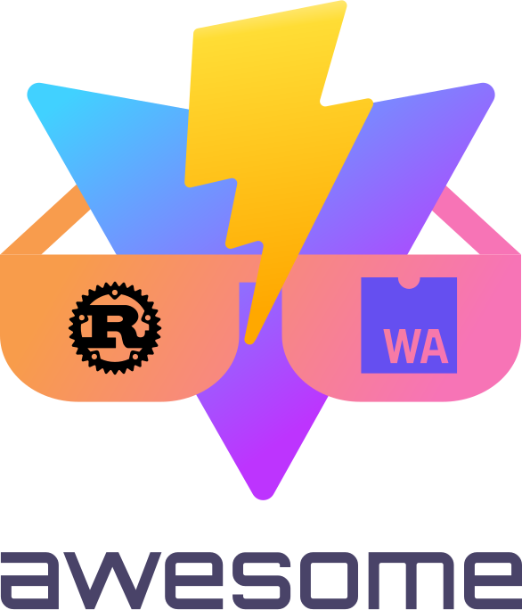

<!--lint disable awesome-git-repo-age awesome-heading awesome-github awesome-toc double-link-->

   
  
   
   

<h2 align='center'>Awesome RSW</h2>

A curated list of awesome things related to <a href='https://github.com/lencx/vite-plugin-rsw'>vite-plugin-rsw</a>
  

## Get Started

* [create-mpl](https://github.com/lencx/create-mpl) - ⚡️ Create a project in seconds!
  * `npm init mpl@latest -- --type wasm`

## Apps/Websites

* [learn-wasm](https://github.com/lencx/learn-wasm) - Learning WebAssembly.
